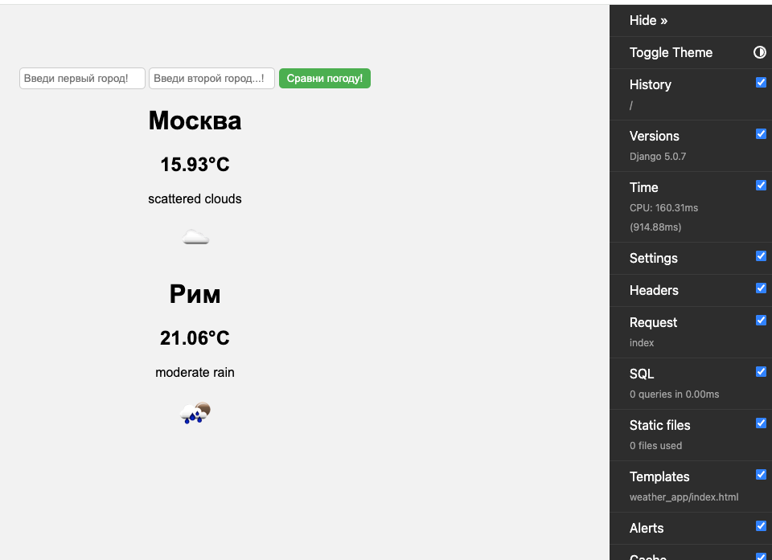

# Weather Comparison App

## Описание
Weather Comparison App - это веб-приложение, разработанное на Django, которое позволяет пользователям сравнивать текущие погодные условия

## Цели проекта
- Сравнение погоды: Предоставить пользователям возможность сравнивать текущие погодные условия
- Удобство использования: Обеспечить простой и интуитивно понятный интерфейс для ввода данных и отображения результатов.
- Динамическое отображение: Использовать динамические фоны и иконки для улучшения визуального восприятия.

## Основные функции
1. Получение текущей погоды: Приложение использует API OpenWeatherMap для получения текущих погодных условий.
   https://openweathermap.org/current - для текущей погоды
   https://openweathermap.org/forecast5 - прогноз на 5 дней/3 часа
3. Прогноз погоды: Приложение также предоставляет прогноз погоды на несколько дней вперед(на текущий момент не удалось реализовать,в процессе)
4. Сравнение городов: Пользователи могут вводить два города для сравнения их погодных условий.
5. Обработка ошибок: Приложение корректно обрабатывает некорректный ввод.

## Технологии
- Django: Основной фреймворк для разработки веб-приложения.
- HTML/CSS: Для создания пользовательского интерфейса.
- API OpenWeatherMap: Для получения данных о погоде.

## Установка и запуск
1. Клонируйте репозиторий:
   
    git clone https://github.com/dfefelov777/WeatherAppCompare_1.0.git
    
2. Перейдите в директорию проекта:
   
    cd WeatherAppCompare_1.0/Weather_App_Django/weather_project
    
3. Установите зависимости:
   
    pip install -r requirements.txt
    
4. Выполните миграции базы данных:
   
    python manage.py migrate
    
5. Запустите сервер разработки:
   
    python manage.py runserver
    
## Использование
1. Откройте браузер и перейдите по адресу http://127.0.0.1:8000/.
2. Введите названия двух городов для сравнения их погодных условий.
3. Нажмите кнопку "Сравни погоду" для отображения текущих погодных условий

## Заключение
Проект "Weather Comparison App" демонстрирует возможности Django для создания интерактивных веб-приложений. Он предоставляет пользователям удобный способ сравнения погодных условий в разных городах.
## Оффтоп
По API  есть ограничение на количество запросов, поэтому нужно дорабатывать приложение , использовать прокси.
